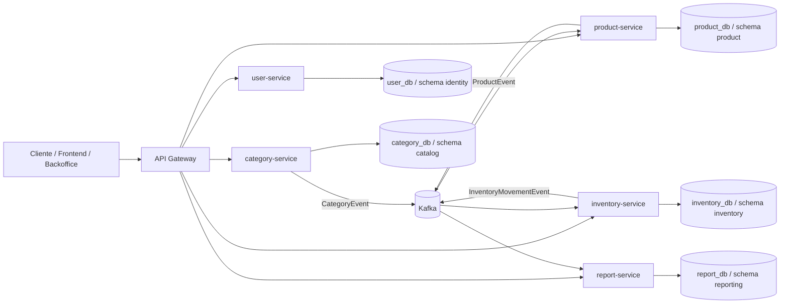

# Arquitectura objetivo

## Vista de alto nivel

## Decisiones clave

### 1. Bounded contexts claros

- `user-service` concentra identidad, autenticación y autorización.
- `category-service` es dueño exclusivo del catálogo de categorías.
- `product-service` es dueño exclusivo del catálogo de productos.
- `inventory-service` es dueño exclusivo del stock y del ledger de movimientos.
- `report-service` construye proyecciones denormalizadas para consultas y analítica.

### 2. Comunicación híbrida

- `REST reactivo` para operaciones síncronas de comando y consulta.
- `Kafka` para propagación de cambios de dominio, desacoplamiento y actualización de proyecciones.

### 3. Base de datos por servicio

Cada microservicio usa su propia base PostgreSQL lógica y esquema dedicado:

- `gym_user_db` / `identity`
- `gym_category_db` / `catalog`
- `gym_product_db` / `product`
- `gym_inventory_db` / `inventory`
- `gym_report_db` / `reporting`

Esto evita acoplamiento directo entre esquemas y preserva la autonomía de cada servicio.

### 4. Estrategia de consistencia

- Las escrituras críticas se resuelven en el servicio dueño del agregado.
- La consistencia entre servicios es eventual y se logra mediante eventos.
- `product-service` valida categorías contra una proyección local mantenida por eventos.
- `inventory-service` valida productos contra una proyección local mantenida por eventos.
- `report-service` consume eventos y expone consultas optimizadas.

## Microservicios y responsabilidades

### `api-gateway`

- Enrutamiento centralizado.
- CORS.
- Punto único de exposición externa.

### `user-service`

- Login JWT.
- Alta, listado y cambio de estado de usuarios.
- Bootstrap de usuario administrador.

### `category-service`

- CRUD limitado para categorías.
- Publicación de eventos `CategoryEvent`.

### `product-service`

- CRUD limitado para productos.
- Validación de pertenencia obligatoria a categoría.
- Consumo de eventos de categoría.
- Publicación de eventos `ProductEvent`.

### `inventory-service`

- Registro de entradas y salidas.
- Rechazo de salidas con stock insuficiente.
- Mantenimiento de stock actual.
- Consumo de eventos de producto.
- Publicación de eventos `InventoryMovementEvent`.

### `report-service`

- Proyecciones de stock.
- Reportes de bajo stock.
- Resumen de movimientos.
- Consumo de eventos de categoría, producto e inventario.

## Patrones aplicados

- API Gateway
- Database per Service
- Event-Driven Architecture
- Materialized Views
- DDD táctico ligero por servicio
- Configuration via environment variables

